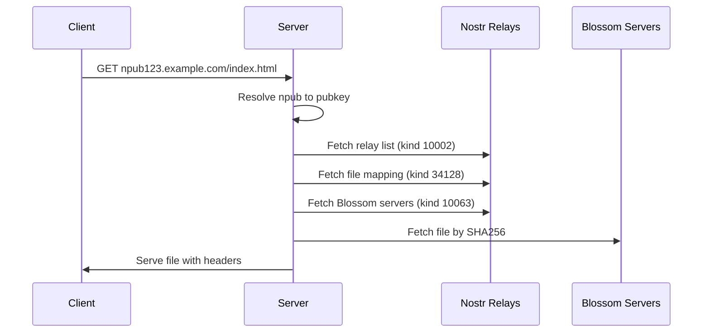

# Nostr Deploy - Server Implementation

A Node.js server implementation for serving static websites under npub subdomains using the Nostr protocol and Blossom servers. This server implements the [Pubkey Static Websites](https://nostrhub.io/naddr1qvzqqqrcvypzqfngzhsvjggdlgeycm96x4emzjlwf8dyyzdfg4hefp89zpkdgz99qqt8qatzddjhjttnw3shg6tr94mk2cnnd96x2uch7k70g) NIP specification, allowing decentralized hosting of static websites without storing any data locally.

## 🌟 Features

- **Decentralized Hosting**: Serves websites using Nostr events (kind 34128) for path mappings and Blossom servers for file storage
- **Npub Subdomains**: Supports `npub1xxx.example.com` wildcard subdomain routing
- **Zero Storage**: Acts as a pure proxy/gateway without storing any files locally
- **Intelligent Caching**: In-memory caching with TTL for improved performance
- **Automatic Fallbacks**: Falls back to `/404.html` for missing files and default servers when user configurations are unavailable
- **Health Monitoring**: Built-in health checks and admin statistics endpoints
- **Rate Limiting**: Configurable rate limiting to prevent abuse
- **Graceful Shutdown**: Proper cleanup of connections and resources

## 📋 NIP Implementation

This server implements the [Pubkey Static Websites](https://nostrhub.io/naddr1qvzqqqrcvypzqfngzhsvjggdlgeycm96x4emzjlwf8dyyzdfg4hefp89zpkdgz99qqt8qatzddjhjttnw3shg6tr94mk2cnnd96x2uch7k70g) NIP which allows:

1. **Static File Events (Kind 34128)**: Maps file paths to SHA256 hashes

   ```json
   {
     "kind": 34128,
     "tags": [
       ["d", "/index.html"],
       ["x", "186ea5fd14e88fd1ac49351759e7ab906fa94892002b60bf7f5a428f28ca1c99"]
     ]
   }
   ```

2. **Relay Lists (Kind 10002)**: User's preferred Nostr relays (NIP-65)
3. **Blossom Server Lists (Kind 10063)**: User's preferred Blossom servers (BUD-03)

## 🚀 Quick Start

### Prerequisites

- Node.js 16+
- Wildcard SSL certificate for `*.your-domain.com`
- DNS wildcard record pointing to your server

### Installation

```bash
# Install dependencies
npm install

# Copy and configure environment
cp env.example .env
# Edit .env with your settings

# Build the project
npm run build

# Start the server
npm start
```

### Development

```bash
# Run in development mode with auto-reload
npm run dev

# Run tests
npm test

# Run tests in watch mode
npm run test:watch

# Check code quality
npm run lint
npm run lint:fix
```

## ⚙️ Configuration

Configure the server using environment variables or create a `.env` file:

```bash
# Server Configuration
PORT=3000
NODE_ENV=production

# Domain Configuration
BASE_DOMAIN=example.com

# Default Nostr Relays (comma-separated)
DEFAULT_RELAYS=wss://nos.lol,wss://ditto.pub/relay,wss://relay.damus.io

# Default Blossom Servers (comma-separated)
DEFAULT_BLOSSOM_SERVERS=https://cdn.hzrd149.com,https://nostr.download

# Caching Configuration
CACHE_TTL_SECONDS=300
MAX_CACHE_SIZE=100

# Rate Limiting
RATE_LIMIT_WINDOW_MS=60000
RATE_LIMIT_MAX_REQUESTS=100

# Security & Performance
CORS_ORIGIN=*
TRUST_PROXY=false
REQUEST_TIMEOUT_MS=30000
MAX_FILE_SIZE_MB=50
LOG_LEVEL=info
```

### SSL Certificate Setup

For production deployment, you need a wildcard SSL certificate:

```bash
# Example with Let's Encrypt/Certbot
certbot certonly --dns-cloudflare \
  --dns-cloudflare-credentials ~/.secrets/cloudflare.ini \
  -d "*.example.com" \
  -d "example.com"

# Update .env with certificate paths
WILDCARD_CERT_PATH=/etc/letsencrypt/live/example.com/fullchain.pem
WILDCARD_KEY_PATH=/etc/letsencrypt/live/example.com/privkey.pem
```

## 🌐 How It Works

### 1. Request Flow



### 2. Path Resolution

- `/` → `/index.html`
- `/blog/` → `/blog/index.html`
- `/about` → `/about/index.html` (if no extension)
- Missing files → `/404.html` fallback

### 3. Caching Strategy

- **Path Mappings**: 5 minutes TTL
- **Relay Lists**: 5 minutes TTL
- **Blossom Server Lists**: 5 minutes TTL
- **File Content**: 30 minutes TTL
- **Error Results**: 1 minute TTL

## 🔌 API Endpoints

### Health Check

```bash
GET /health
```

Returns server status, uptime, and connection statistics.

### Admin Statistics

```bash
GET /admin/stats
```

Returns detailed server statistics including Nostr connections, Blossom server health, and cache metrics.

### Static File Serving

```bash
GET *
```

Main endpoint that serves static files based on npub subdomain routing.

## 🏗️ Architecture

### Project Structure

```
/
├── src/
│   ├── types/           # TypeScript type definitions
│   ├── utils/           # Utility classes (config, logger, cache)
│   ├── helpers/         # Core helpers (Nostr, Blossom)
│   ├── __tests__/       # Test files
│   └── server.ts        # Main server application
├── dist/                # Compiled JavaScript (generated)
├── package.json
├── tsconfig.json
├── jest.config.js
└── README.md
```

### Core Components

- **ConfigManager**: Environment configuration and validation
- **Logger**: Structured logging with Winston
- **MemoryCache**: TTL-based in-memory caching
- **NostrHelper**: Nostr relay communication and event parsing
- **BlossomHelper**: Blossom server file fetching
- **Express Server**: HTTP request handling and routing

## 🧪 Testing

The server includes comprehensive test coverage:

```bash
# Run all tests
npm test

# Run specific test files
npm test -- config.test.ts
npm test -- nostr.test.ts

# Run with coverage
npm test -- --coverage

# Watch mode for development
npm run test:watch
```

### Test Categories

- **Unit Tests**: Individual component testing
- **Integration Tests**: Component interaction testing
- **Mock Tests**: External service simulation
- **Configuration Tests**: Environment validation

## 🚀 Production Deployment

### Docker Deployment

```dockerfile
FROM node:18-alpine

WORKDIR /app
COPY package*.json ./
RUN npm ci --only=production

COPY dist/ ./dist/
COPY .env ./

EXPOSE 3000
CMD ["node", "dist/server.js"]
```

### Reverse Proxy Configuration

#### Nginx

```nginx
server {
    listen 443 ssl http2;
    server_name *.example.com;

    ssl_certificate /path/to/wildcard.crt;
    ssl_certificate_key /path/to/wildcard.key;

    location / {
        proxy_pass http://localhost:3000;
        proxy_set_header Host $host;
        proxy_set_header X-Real-IP $remote_addr;
        proxy_set_header X-Forwarded-For $proxy_add_x_forwarded_for;
        proxy_set_header X-Forwarded-Proto $scheme;
    }
}
```

#### Apache

```apache
<VirtualHost *:443>
    ServerName *.example.com
    ServerAlias *.example.com

    SSLEngine on
    SSLCertificateFile /path/to/wildcard.crt
    SSLCertificateKeyFile /path/to/wildcard.key

    ProxyPass / http://localhost:3000/
    ProxyPassReverse / http://localhost:3000/
    ProxyPreserveHost On
</VirtualHost>
```

### Process Management

#### PM2

```bash
# Install PM2
npm install -g pm2

# Start with PM2
pm2 start dist/server.js --name nostr-deploy-server

# Setup auto-restart
pm2 startup
pm2 save
```

#### Systemd

```ini
[Unit]
Description=Nostr Deploy Server
After=network.target

[Service]
Type=simple
User=www-data
WorkingDirectory=/var/www/nostr-deploy-server
ExecStart=/usr/bin/node dist/server.js
Restart=always
RestartSec=10
Environment=NODE_ENV=production

[Install]
WantedBy=multi-user.target
```

## 🔧 Troubleshooting

### Common Issues

1. **Invalid npub subdomains returning 404**

   - Check BASE_DOMAIN configuration
   - Verify wildcard DNS setup
   - Ensure npub format is correct

2. **Files not loading from Blossom servers**

   - Check DEFAULT_BLOSSOM_SERVERS configuration
   - Verify network connectivity to Blossom servers
   - Check server logs for specific error messages

3. **Slow response times**

   - Increase CACHE_TTL_SECONDS
   - Increase MAX_CACHE_SIZE
   - Check network latency to relays/Blossom servers

4. **Rate limiting issues**
   - Adjust RATE_LIMIT_MAX_REQUESTS
   - Adjust RATE_LIMIT_WINDOW_MS
   - Implement IP whitelisting if needed

### Debug Mode

```bash
# Enable debug logging
LOG_LEVEL=debug npm start

# Check server health
curl http://localhost:3000/health

# Check admin stats
curl http://localhost:3000/admin/stats
```

## 🤝 Contributing

1. Fork the repository
2. Create a feature branch
3. Make your changes with tests
4. Ensure all tests pass: `npm test`
5. Submit a pull request

### Development Guidelines

- Follow TypeScript best practices
- Maintain test coverage above 80%
- Use meaningful commit messages
- Update documentation for new features

## 📄 License

MIT License - see LICENSE file for details.

## 🔗 Related Projects

- [Nostr Deploy CLI](https://github.com/sepehr-safari/nostr-deploy-cli) - CLI tool for deploying static sites
- [Nostr Protocol](https://github.com/nostr-protocol/nostr)
- [Blossom Protocol](https://github.com/hzrd149/blossom)

## 🙋‍♂️ Support

- Create an issue for bug reports
- Check existing issues before creating new ones
- Join the Nostr community for protocol discussions
